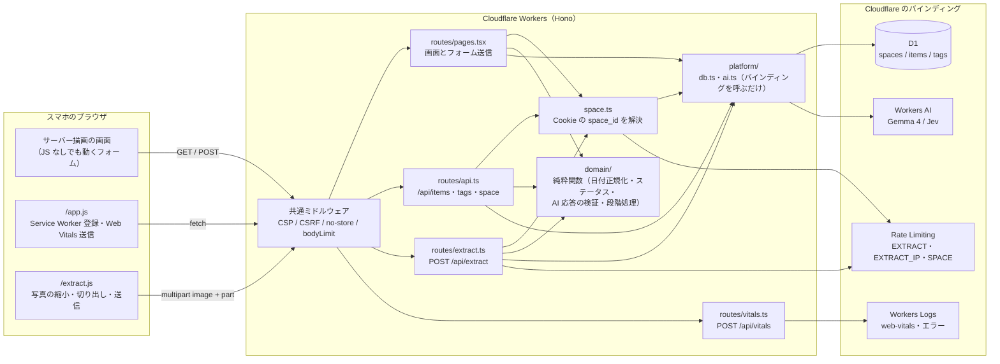
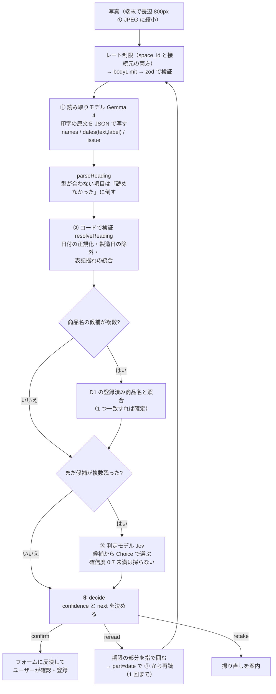
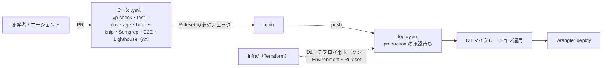

# アーキテクチャ

仕様は [requirements.md](./requirements.md)、個々の判断の理由は [adr/](./adr/) を参照。この文書は全体像と、AI がどこで何をしているかをまとめる。

## 全体構成

- 画面はサーバー描画（Hono JSX）で、フォームは JS なしでも送れる（[ADR 0002](./adr/0002-server-rendered-forms.md)）。クライアント JS は `/app.js` と `/extract.js` の 2 つだけで、同一オリジンから配信する
- ユーザー登録は無く、Cookie の `space_id` がデータの単位（スペース）。共有 URL `/s/<space_id>` で他の端末と共有する（[ADR 0001](./adr/0001-space-resolution.md) / [ADR 0012](./adr/0012-space-id-exposure.md)）
- `src/domain/` は副作用の無い純粋関数でカバレッジ 100%。`src/platform/` は D1 / Workers AI を呼ぶだけの薄い層

## 写真からの読み取り（AI の段階処理）

`POST /api/extract` の処理は `src/domain/pipeline.ts` の `extractItem` にまとまっている（[ADR 0007](./adr/0007-staged-extraction.md)）。

失敗したときはどこでも手入力に戻れる。レート制限超過は `429`、読み取りモデルの失敗は `502`、判定モデルの失敗は候補を返してユーザーに選ばせる。

## AI の役割

### アプリの中で動く AI（Workers AI）

| 段階 | 担当                                           | 役割                                                                                                                                                                                                                                                           | やらないこと                                                                |
| ---- | ---------------------------------------------- | -------------------------------------------------------------------------------------------------------------------------------------------------------------------------------------------------------------------------------------------------------------- | --------------------------------------------------------------------------- |
| ①    | **Gemma 4**（`@cf/google/gemma-4-26b-a4b-it`） | 目。写真に印字された商品名・日付・日付の近くの文言（「賞味期限」「製造日」など）を**原文のまま**書き写す。期限が読めないときは理由（`blur` / `cut_off` / `glare` / `too_small`）も返す。`json_schema` で形を固定し、`enable_thinking: false`・`temperature: 0` | 日付の正規化、どれが期限かの判断、確信度の自己申告                          |
| ②    | **コード**（`src/domain/extract.ts`）          | 検算役。日付として成立するか、製造日などを外す、期限の文言付きを優先、商品名の表記揺れをまとめる、登録済み商品名との照合。決めきれるものはここで決める                                                                                                         | —                                                                           |
| ③    | **Jev**（`typesafe/jev`）                      | 審判。②で決めきれず**候補が複数残った項目だけ**に呼ぶ。「どれが商品名か」「どれが賞味・消費期限か」を候補の中から選ばせる                                                                                                                                      | 自由記述の回答、候補に無い値の生成（候補外と確信度 0.7 未満の答えは捨てる） |
| ④    | **コード**（`decide`）                         | 次の行動（`confirm` / `reread` / `retake`）と `confidence` を決める。コードだけで決まれば `high`、Jev が選べば `medium`、決まらなければ `low`                                                                                                                  | —                                                                           |
| —    | **ユーザー**                                   | 最終確認。候補から選ぶ・期限の部分を囲んで再読させる・撮り直す・手入力する。登録するのは常にユーザー                                                                                                                                                           | —                                                                           |

設計の考え方:

- **AI の出力は信用しない**。応答は `unknown` のまま `src/platform/ai.ts` から返し、必ず `parseReading` / `parseJudgement`（zod）を通す
- **生成させず、選ばせる**。Gemma には写すだけ、Jev には候補から選ぶだけをさせ、値を作るのはコード
- **呼ぶ回数を減らす**。Gemma は毎回 1 回、Jev は曖昧なときだけ。登録が増えるほど商品名は D1 の履歴で決まり、Jev を呼ばずに済む。1 回の読み取りで最大 2 回（部分再読込みで最大 4 回）
- モデルの比較は `bun run extract-eval`（`scripts/extract-eval.ts`）。本番と同じ `extractItem` と `readingInput` を使う

### 開発で使う AI エージェント

アプリには組み込まれず、開発作業で使う（[CLAUDE.md](../CLAUDE.md)）。スキルは `.claude/skills/` にあり、Codex / Cursor からは `.agents/skills` のシンボリックリンクで同じものを使う。

| スキル                               | 役割                                                                                      |
| ------------------------------------ | ----------------------------------------------------------------------------------------- |
| `update-plan`                        | プランモードで、計画を要件・ROADMAP・ADR・migrations・src と照合してから確定させる        |
| `grill-me`                           | 設計を質問攻めにして詰める。決まったことは ADR に残す                                     |
| `wrapup`                             | 作業完了時のゲート。`/code-review` → `ponytail-review` → 取り込み → `cleanup-comments`    |
| `ponytail-review` / `ponytail-audit` | 過剰設計の検出（差分 / リポジトリ全体）。消せるもの・標準機能で置き換えられるものを挙げる |
| `cleanup-comments`                   | コードを言い直しているだけのコメントを消し、TODO を issue にする                          |
| `update-docs`                        | docs・README・CLAUDE.md をソースに合わせて更新する                                        |

## デプロイと CI

構成の詳細は [ADR 0005](./adr/0005-deploy-and-e2e.md) / [ADR 0008](./adr/0008-terraform-infra.md)。
